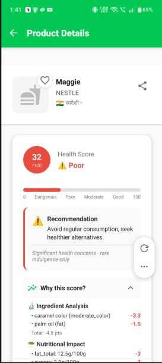

# 🥗 IngreScan — AI-Powered Food Intelligence

> Scan. Analyze. Eat smarter.

IngreScan is a mobile application that analyzes packaged food products and generates **personalized health insights** using ingredient analysis, nutrition data, and machine learning. The app helps users understand what they're eating — and how it affects *their specific health conditions*.

---

## 📱 Screenshots

| Home Dashboard | Barcode Scanner | Health Score | Ingredient Analysis |
|:-:|:-:|:-:|:-:|
|  |  |  |  |

---

## 🚀 Features

### 🔍 Barcode Scanning
Scan any packaged food product using your phone camera to instantly retrieve product data.

### 🧠 Ingredient Risk Analysis
Ingredients are analyzed and categorized into risk levels using food additive databases and ML classification.

### 📊 Personalized Health Score
Each product receives a health score (0–100) based on:
- Sugar content
- Sodium levels
- Saturated fat
- Fiber
- Harmful additives
- User health conditions

### 🧬 Health Condition Personalization
Users can select personal health conditions to receive tailored recommendations:
- Diabetes
- Heart disease
- Hypertension
- High cholesterol

### 🧾 Ingredient Transparency
Every ingredient is surfaced with:
- Natural vs. artificial classification
- Additive & preservative flagging
- Plain-language explanations

### 📈 Daily Nutrition Tracking
Track daily intake across:
- Calories, Carbohydrates, Fats
- Sugar, Sodium

### 👥 Community Verification
Products require multiple user confirmations before being marked as trusted data.

---

## 🏗 Architecture

```
Mobile App (React Native + Expo)
            │
            ▼
      Firebase Backend
            │
            ▼
        Unified FastAPI Backend
            │
            ▼
 External Food Databases
```

---

## 🧠 Health Score Logic

The health score starts at 100 and penalties are applied based on nutritional thresholds:

```python
score = 100

if sugar > threshold:
    score -= penalty

if sodium > threshold:
    score -= penalty

if harmful_additive_detected:
    score -= penalty

if allergen_detected:
    score = 0

score += natural_ingredient_bonus
```

The final score is adjusted based on the user's health profile.

---

## 🛠 Tech Stack

| Layer | Technologies |
|---|---|
| **Frontend** | React Native, Expo |
| **Auth & DB** | Firebase Authentication, Firebase Firestore |
| **Backend** | Python, FastAPI |
| **ML** | DistilBERT, PyTorch, Transformers |
| **External APIs** | OpenFoodFacts, Edamam, FatSecret |

---

## ⚙️ Getting Started

### 1. Clone the Repository

```bash
git clone https://github.com/yourusername/ingrescan.git
cd ingrescan
```

### 2. Start the Backend Server

```bash
python server/product_data_api.py
```

### 3. Start the Frontend App

```bash
npx expo start
```

---

## 📂 Project Structure

```
ingrescan/
│
├── src/
│   ├── screens/
│   ├── components/
│   └── utils/
│
├── server/
│   ├── score_api.py
│   ├── ml_engine.py
│   └── data_processing/
│
├── assets/
│   └── screenshots/
│
└── README.md
```

---

## 🎯 Roadmap

- [ ] OCR ingredient extraction (no barcode needed)
- [ ] Offline ML inference
- [ ] Restaurant menu analysis
- [ ] Food recommendation engine
- [ ] Recipe health scoring

---

## ⭐ Why IngreScan?

Most nutrition apps stop at generic nutrition labels.

**IngreScan focuses on personalized food intelligence** — helping users understand how specific products interact with their individual health conditions, not just aggregate calorie counts.

---

## 👤 Author

**Devesh Kichak**

---

*If you found this useful, consider giving the repo a ⭐*
