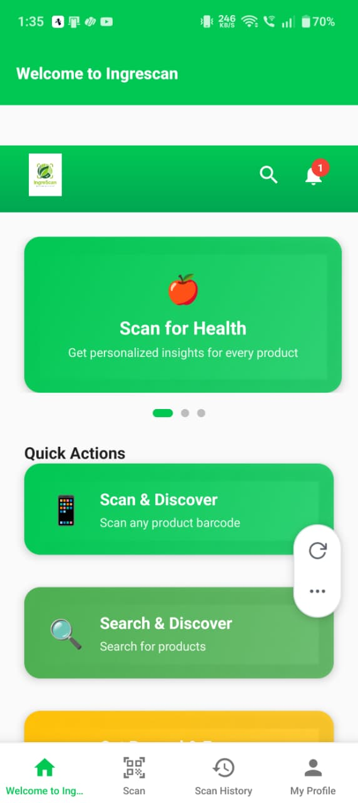
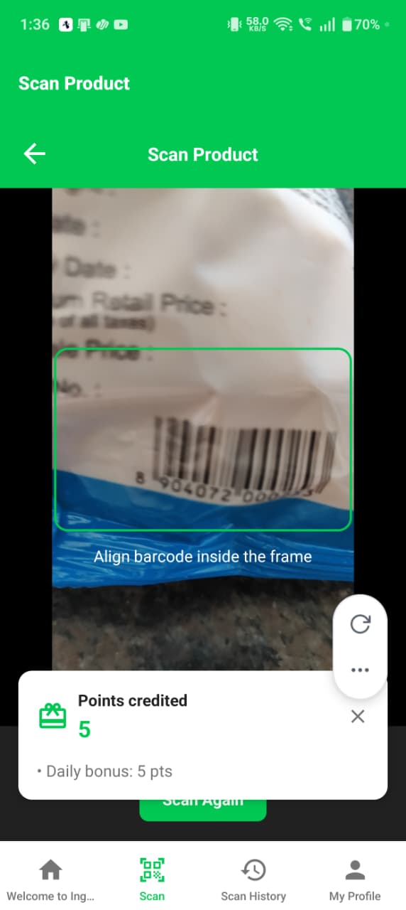
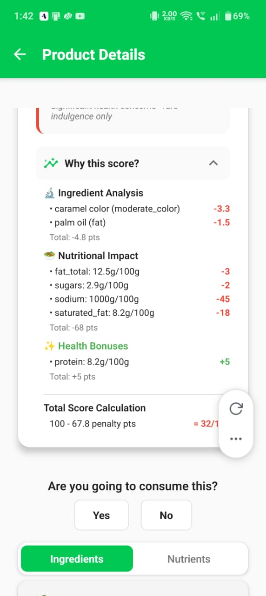
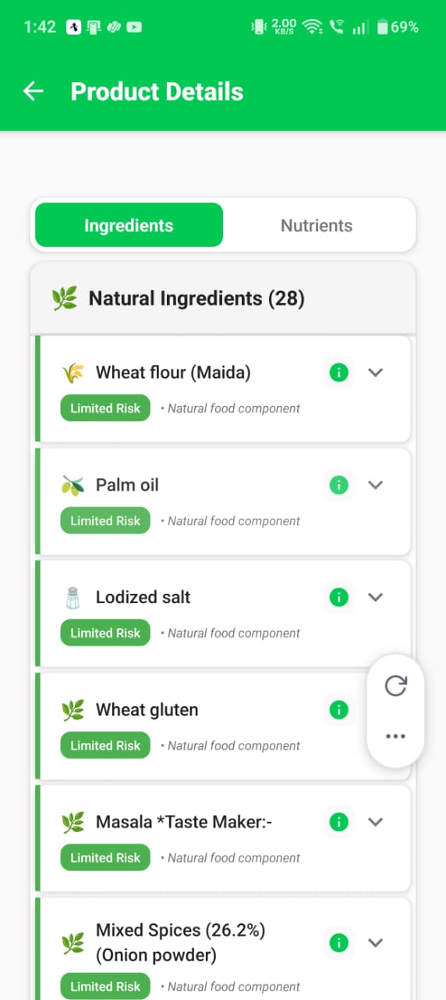
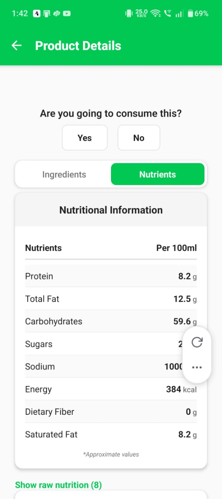
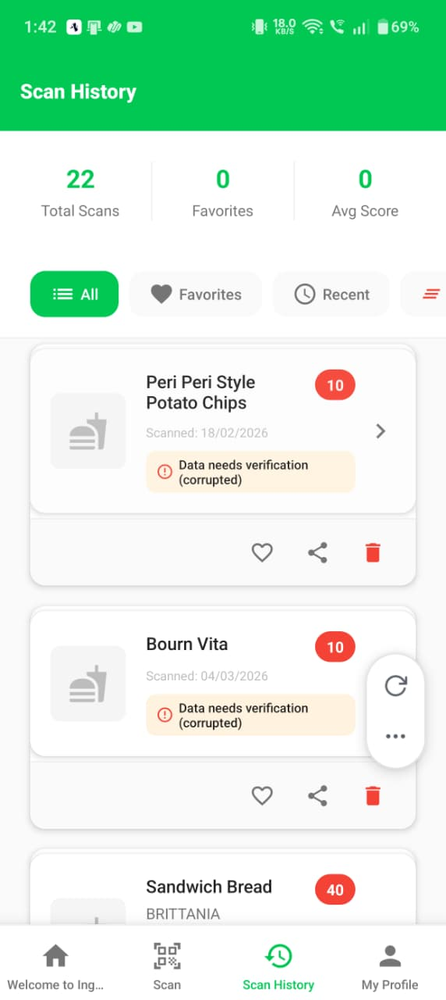
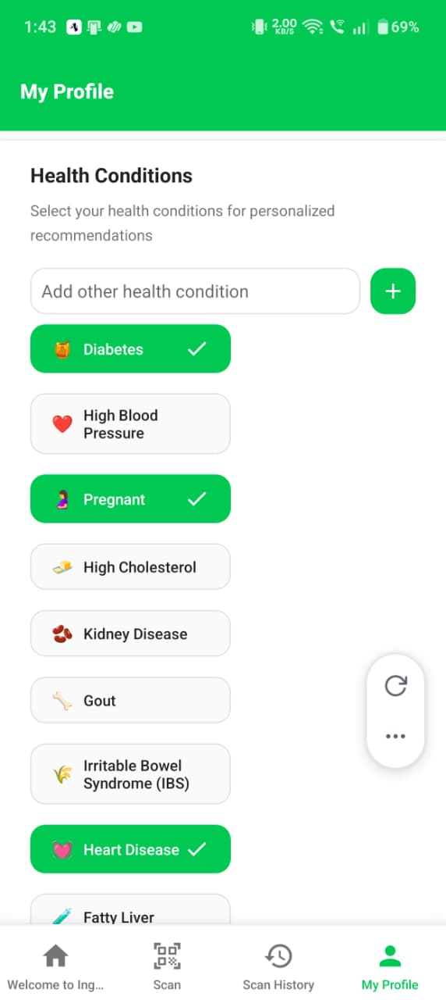
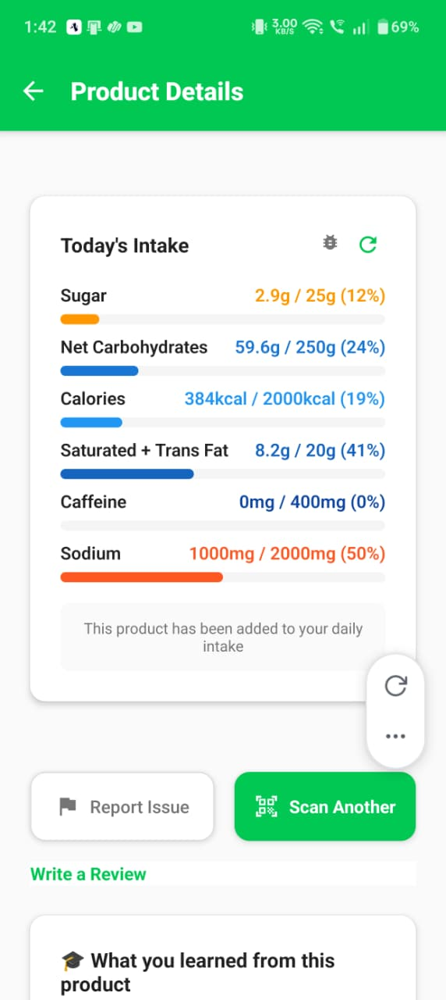

# 🥗 IngreScan — AI-Powered Food Intelligence

> Scan. Analyze. Eat smarter.

📱 Mobile food analysis app that scans packaged products and evaluates their ingredients and nutrition.

🧠 Uses machine learning and ingredient databases to analyze additives, preservatives, and nutritional values.

📊 Generates a personalized health score based on nutritional impact and ingredient risk levels.

🧬 Adapts recommendations according to user health conditions (e.g., diabetes, hypertension).

🥗 Helps users make informed food choices by clearly explaining what is inside a product and its health impact.

---

## 🚀 Features

### 🔍 Barcode Scanning
Scan any packaged food product using your phone camera to instantly retrieve product data.

### 🧠 Ingredient Risk Analysis
Ingredients are analyzed and categorized into risk levels using food additive databases and ML classification.

### 📊 Personalized Health Score
Each product receives a health score (0–100) based on:
- Sugar content
- Sodium levels
- Saturated fat
- Fiber
- Harmful additives
- User health conditions

### 🧬 Health Condition Personalization
Users can select personal health conditions to receive tailored recommendations:
- Diabetes
- Heart disease
- Hypertension
- High cholesterol
- Pregnancy
- Kidney disease, Gout, IBS, Fatty Liver, and more

### 🧾 Ingredient Transparency
Every ingredient is surfaced with:
- Natural vs. artificial classification
- Additive & preservative flagging
- Plain-language explanations

### 📈 Daily Nutrition Tracking
Track daily intake across:
- Calories, Carbohydrates, Fats
- Sugar, Sodium

### 👥 Community Verification
Products require multiple user confirmations before being marked as trusted data.

---

## 📱 Screenshots

<table>
  <tr>
    <td align="center"><b>Home Dashboard</b></td>
    <td align="center"><b>Barcode Scanner</b></td>
    <td align="center"><b>Health Score</b></td>
    <td align="center"><b>Ingredient Analysis</b></td>
  </tr>
  <tr>
    <td></td>
    <td></td>
    <td></td>
    <td></td>
  </tr>
  <tr>
    <td align="center"><b>Nutritional Info</b></td>
    <td align="center"><b>Scan History</b></td>
    <td align="center"><b>Health Conditions</b></td>
    <td align="center"><b>Daily Intake</b></td>
  </tr>
  <tr>
    <td></td>
    <td></td>
    <td></td>
    <td></td>
  </tr>
</table>

---

## 🏗 Architecture

```
Mobile App (React Native + Expo)
            │
            ▼
      Firebase Backend
            │
            ▼
    Python ML Scoring API
            │
            ▼
 External Food Databases
```

---

## 🧠 Health Score Logic

The health score starts at 100 and penalties are applied based on nutritional thresholds:

```python
score = 100

if sugar > threshold:
    score -= penalty

if sodium > threshold:
    score -= penalty

if harmful_additive_detected:
    score -= penalty

if allergen_detected:
    score = 0

score += natural_ingredient_bonus
```

The final score is adjusted based on the user's health profile.

---

## 🛠 Tech Stack

| Layer | Technologies |
|---|---|
| **Frontend** | React Native, Expo |
| **Auth & DB** | Firebase Authentication, Firebase Firestore |
| **Backend** | Python, FastAPI / Flask |
| **ML** | DistilBERT, PyTorch, Transformers |
| **External APIs** | OpenFoodFacts, Edamam, FatSecret |

---

## ⚙️ Getting Started

### 1. Clone the Repository

```bash
git clone https://github.com/yourusername/ingrescan.git
cd ingrescan
```

### 2. Start the Backend Server

```bash
python server/score_api.py
```

### 3. Start the Frontend App

```bash
npx expo start
```

---

## 📂 Project Structure

```
ingrescan/
│
├── src/
│   ├── screens/
│   │   ├── HomeScreen.jsx
│   │   ├── ScanScreen.jsx
│   │   ├── ProductDetailsScreen.jsx
│   │   ├── IngredientsScreen.jsx
│   │   ├── NutritionScreen.jsx
│   │   ├── ScanHistoryScreen.jsx
│   │   └── HealthConditionsScreen.jsx
│   ├── components/
│   └── utils/
│
├── server/
│   ├── score_api.py
│   ├── ml_engine.py
│   ├── train_distilbert_pytorch.py
│   └── data_processing/
│
└── README.md
```

---

## ⭐ Why IngreScan?

Most nutrition apps stop at generic nutrition labels.

**IngreScan focuses on personalized food intelligence** — helping users understand how specific products interact with their individual health conditions, not just aggregate calorie counts.

---

## 👤 Author

**Dhruv Karani & Amogh Iyer**

---

*If you found this useful, consider giving the repo a ⭐*
